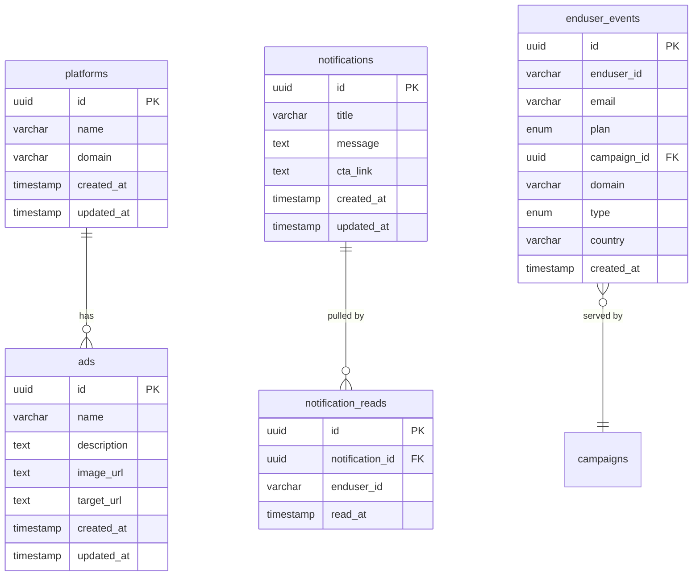

# Database Schema Documentation

## Overview

The database uses PostgreSQL with Drizzle ORM for type-safe database operations. The live Drizzle schema includes platforms, ads, notifications (content), campaigns, **`end_users`** / **`enduser_sessions`** (extension auth: **provision**, login, register; **one session per user**; Bearer tokens), **payments**, and **`enduser_events`** (one row per extension serve or `request`; `enduser_id` is the extension user id). **`end_users`** rows may be **anonymous** (`installation_id`, nullable `email`/`password_hash`, **`short_id`** for display) until the user registers. Better Auth’s **`user`** / **`session`** tables are for dashboard admins only. A legacy **`notification_reads`** table may still exist in older databases; the current extension API does not use it (see **`enduser_events`** + campaign rules).

## Entity Relationship Diagram



## Tables

### platforms

Stores platform/domain configurations where ads and notifications will be displayed.

| Column | Type | Constraints | Description |
|--------|------|------------|-------------|
| `id` | uuid | PRIMARY KEY, DEFAULT gen_random_uuid() | Unique platform identifier |
| `name` | varchar(255) | NOT NULL | Platform name (e.g., "Instagram", "Facebook") |
| `domain` | varchar(255) | NOT NULL | Domain URL (e.g., "https://www.instagram.com/") |
| `created_at` | timestamp with time zone | NOT NULL, DEFAULT now() | Creation timestamp |
| `updated_at` | timestamp with time zone | NOT NULL, DEFAULT now() | Last update timestamp |

**Relationships:**
- One-to-many with `ads` (via `platform_id`)

**Indexes:**
- Primary key on `id`
- Unique constraint implied by primary key

**Usage:**
- Admin creates platforms to define where content will be shown
- Extension API uses domain to filter ads/notifications

---

### ads

Stores advertisement content with scheduling and platform association.

| Column | Type | Constraints | Description |
|--------|------|------------|-------------|
| `id` | uuid | PRIMARY KEY, DEFAULT gen_random_uuid() | Unique ad identifier |
| `name` | varchar(255) | NOT NULL | Ad name/title |
| `description` | text | NULL | Optional ad description |
| `image_url` | text | NULL | URL to ad image/banner |
| `target_url` | text | NULL | URL to redirect when ad is clicked |
| `platform_id` | uuid | FOREIGN KEY, NULL | Associated platform (null = all platforms) |
| `status` | enum | NOT NULL, DEFAULT 'inactive' | Ad status (see enum below) |
| `start_date` | timestamp with time zone | NULL | When ad becomes active |
| `end_date` | timestamp with time zone | NULL | When ad expires |
| `created_at` | timestamp with time zone | NOT NULL, DEFAULT now() | Creation timestamp |
| `updated_at` | timestamp with time zone | NOT NULL, DEFAULT now() | Last update timestamp |

**Status Enum Values:**
- `active` - Currently active and visible
- `inactive` - Manually deactivated
- `scheduled` - Scheduled for future activation
- `expired` - Automatically expired (end date passed)

**Relationships:**
- Many-to-one with `platforms` (via `platform_id`)
  - Foreign key with `ON DELETE SET NULL` (platform deletion doesn't delete ads)

**Indexes:**
- Primary key on `id`
- Foreign key index on `platform_id`

**Usage:**
- Admin creates ads with images and target URLs
- Ads can be scheduled with start/end dates
- Status automatically changes to 'expired' when end date passes
- Extension API returns only ads with `status = 'active'`

**Auto-Expiration:**
Ads with `status = 'active'` and `end_date < now()` are automatically updated to `status = 'expired'` when the dashboard loads.

---

### notifications

Stores notification messages with date ranges and multi-platform support.

| Column | Type | Constraints | Description |
|--------|------|------------|-------------|
| `id` | uuid | PRIMARY KEY, DEFAULT gen_random_uuid() | Unique notification identifier |
| `title` | varchar(255) | NOT NULL | Notification title |
| `message` | text | NOT NULL | Notification message content |
| `start_date` | timestamp with time zone | NOT NULL | When notification becomes active |
| `end_date` | timestamp with time zone | NOT NULL | When notification expires |
| `is_read` | boolean | NOT NULL, DEFAULT false | Read status (admin use) |
| `created_at` | timestamp with time zone | NOT NULL, DEFAULT now() | Creation timestamp |
| `updated_at` | timestamp with time zone | NOT NULL, DEFAULT now() | Last update timestamp |

**Relationships:**
- Referenced by **`campaigns.notification_id`** (notification campaigns)

**Indexes:**
- Primary key on `id`

**Usage (current app):**
- Notifications are **content** rows (title, message, CTA). **Scheduling, targeting, and frequency** live on **`campaigns`** where `campaign_type = 'notification'`.
- Extension **`POST /api/extension/ad-block`** authenticates with **`Authorization: Bearer`** (session in **`enduser_sessions`**). Eligibility and “only once” / caps use **`enduser_events`** counts per `enduser_id` and `campaign_id`, not request-body `endUserId`.

---

### notification_reads (legacy)

**Not present in `src/db/schema.ts`.** Older deployments may still have this table; the current `/api/extension/ad-block` implementation does **not** read or write it.

| Column | Type | Constraints | Description |
|--------|------|------------|-------------|
| `id` | uuid | PRIMARY KEY, DEFAULT gen_random_uuid() | Unique record identifier |
| `notification_id` | uuid | NOT NULL, FOREIGN KEY | Notification reference |
| `enduser_id` | varchar(255) | NOT NULL | Historical: client id string |
| `read_at` | timestamp with time zone | NOT NULL, DEFAULT now() | When the row was recorded |

**Relationships:**
- Many-to-one with `notifications` (via `notification_id`), ON DELETE CASCADE (if table exists)

**Unique constraint (if table exists):** `(notification_id, enduser_id)` — one row per user per notification.

---

### enduser_events

Event-based table: one row per extension serve or logged request. Replaces former `request_logs`, `campaign_logs`, and `campaign_visitor_views` tables. **Not** the Better Auth `user` table (dashboard admins).

| Column | Type | Constraints | Description |
|--------|------|------------|-------------|
| `id` | uuid | PRIMARY KEY, DEFAULT gen_random_uuid() | Unique event identifier |
| `enduser_id` | varchar(255) | NOT NULL | Extension user id: **`end_users.id`** as a string (Bearer-authenticated clients) |
| `email` | varchar(255) | NULL | Copy of extension user email when set (null for anonymous users) |
| `plan` | enduser_user_plan | NOT NULL | `trial` \| `paid` (aligned with **`end_users.plan`**) |
| `campaign_id` | uuid | NULL, FK → campaigns.id | Campaign that served content (null for e.g. `request`-only rows) |
| `domain` | varchar(255) | NULL | Domain where request occurred |
| `type` | enduser_event_type | NOT NULL | `ad` \| `notification` \| `popup` \| `request` \| `redirect` |
| `country` | varchar(2) | NULL | Geo hint from edge headers |
| `status_code`, `user_agent` | integer, text | NULL | Telemetry when present |

**Relationships:**
- Many-to-one with `campaigns` (via `campaign_id`)

**Indexes:**
- Primary key on `id`
- `(campaign_id, created_at DESC)` for campaign logs
- `(enduser_id, campaign_id)` for frequency tracking
- `(enduser_id, created_at DESC)` for end-user analytics

**Usage:**
- Inserted when the extension hits `/api/extension/ad-block` (one row per campaign served, or a `request` row when nothing served)
- Campaign logs: `WHERE campaign_id = :id`
- Frequency: `COUNT(*) WHERE enduser_id = :v AND campaign_id = :c`
- Unique extension end users: `COUNT(DISTINCT enduser_id)`

---

## Enums

### ad_status

Ad status enumeration.

- `active` - Ad is currently active and visible
- `inactive` - Ad is manually deactivated
- `scheduled` - Ad is scheduled for future activation
- `expired` - Ad has expired (end date passed)

**Default:** `inactive`

**Status Transitions:**
- Created → `inactive` (default)
- Admin activates → `active`
- Admin schedules → `scheduled`
- End date passes → `expired` (automatic)
- Admin deactivates → `inactive`

### enduser_event_type

Event type enumeration for analytics logging.

- `ad` - Inline ad served
- `notification` - Notification served
- `popup` - Popup ad served

**Usage:**
- Used in `enduser_events` table
- Indicates what type of content was served to the user

---

## Relationships Summary

### One-to-Many

1. **platforms → ads**
   - One platform can have many ads
   - Ad can belong to one platform (or null for all platforms)
   - Foreign key: `ads.platform_id` → `platforms.id`
   - On delete: SET NULL (platform deletion doesn't delete ads)

2. **campaigns → enduser_events** (logical)
   - One campaign can have many end-user events
   - Events reference campaign via `campaign_id` (FK)

### Extension telemetry and notification delivery

1. **`end_users` / `enduser_sessions` → `enduser_events`**
   - **Provision**, login, or register creates/replaces the row in **`enduser_sessions`** (single session per user); ad-block resolves the user from the Bearer token.
   - Each qualifying serve (or a `request` row when nothing is served) appends rows to **`enduser_events`** for frequency and analytics.
2. **Legacy `notification_reads`** (if still in DB): not used by the current extension route; prefer **`enduser_events`** for per-user/campaign history.

---

## Indexes

### Primary Keys
- All tables have UUID primary keys
- Auto-generated using `gen_random_uuid()`

### Foreign Keys
- `campaigns` reference `ads`, `notifications`, `redirects`, and Better Auth `user` (creator)
- `enduser_sessions.end_user_id` → `end_users.id` (ON DELETE CASCADE)
- `payments.end_user_id` → `end_users.id` (ON DELETE CASCADE)
- `enduser_events.campaign_id` → `campaigns.id` (ON DELETE CASCADE)
- If present: `notification_reads.notification_id` → `notifications.id` (ON DELETE CASCADE)

### Unique Constraints
- `end_users.email` (unique; multiple NULLs allowed)
- `end_users.short_id` (unique)
- `end_users.installation_id` (unique; multiple NULLs allowed)
- `end_users`: check **`email IS NOT NULL OR installation_id IS NOT NULL`**
- `enduser_sessions.token` (unique)
- If present: `notification_reads (notification_id, enduser_id)` (unique)

### Indexes
- Primary keys are indexed automatically.
- **PostgreSQL does not create indexes on foreign-key columns by themselves.** Add explicit indexes when you filter or join on those columns (e.g. migration `0004_campaigns_content_fk_indexes` adds btree indexes on `campaigns.ad_id`, `campaigns.notification_id`, and `campaigns.redirect_id` for linked-campaign list queries and aggregates).

---

## Data Types

### UUID
- Used for all primary keys
- Generated automatically
- Type-safe in TypeScript via Drizzle

### Timestamps
- All timestamps use `timestamp with time zone`
- Default to `now()` for creation timestamps
- Updated manually for `updated_at` fields

### Text Fields
- `varchar(255)` for short text (names, titles, domains)
- `text` for longer content (descriptions, messages, URLs)
- No length limits on `text` fields

### Enums
- PostgreSQL native enums
- Type-safe in TypeScript
- Defined in Drizzle schema files

---

## Migration Management

### Generating Migrations

```bash
pnpm db:generate
```

Creates migration files in `drizzle/migrations/` based on schema changes.

### Applying Migrations

```bash
pnpm db:migrate
```

Applies pending migrations to the database.

### Development Shortcut

```bash
pnpm db:push
```

Pushes schema directly to database (dev only, not for production).

### Viewing Database

```bash
pnpm db:studio
```

Opens Drizzle Studio for visual database inspection.

---

## Query Patterns

### Fetching Active Ads for Domain

```typescript
// Find platform by domain
const [platform] = await db
  .select()
  .from(platforms)
  .where(eq(platforms.domain, domain))
  .limit(1);

// Get active ads for platform
const activeAds = await db
  .select()
  .from(ads)
  .where(
    and(
      eq(ads.platformId, platform.id),
      eq(ads.status, 'active')
    )
  );
```

### Fetching Active Notifications Not Yet Pulled by User

```typescript
// Get active notifications that this end user has not yet pulled.
// Date filtering lives on campaigns; join notifications → campaigns.notification_id.
const activeNotifications = await db
  .select({
    id: notifications.id,
    title: notifications.title,
    message: notifications.message,
  })
  .from(notifications)
  .innerJoin(campaigns, eq(campaigns.notificationId, notifications.id))
  .leftJoin(
    notificationReads,
    and(
      eq(notificationReads.notificationId, notifications.id),
      eq(notificationReads.endUserId, endUserId)
    )
  )
  .where(
    and(
      isNull(notificationReads.id),
      eq(campaigns.status, 'active'),
      or(isNull(campaigns.startDate), lte(campaigns.startDate, now)),
      or(isNull(campaigns.endDate), gte(campaigns.endDate, now))
    )
  );
```

### Inserting end-user events (when serving)

```typescript
// One row per campaign served. Insert only when content is actually returned to the user.
await db.insert(enduserEvents).values(
  servedCampaigns.map((c) => ({
    endUserId,
    campaignId: c.id,
    domain,
    type: c.campaignType === 'notification' ? 'notification' : c.campaignType === 'popup' ? 'popup' : 'ad',
    country: resolvedCountry,
  }))
);
```

---

## Best Practices

1. **Always use migrations** for schema changes in production
2. **Use type-safe queries** via Drizzle ORM
3. **Validate input** before database operations
4. **Handle relationships** properly (cascade vs set null)
5. **Index foreign keys** (automatic in PostgreSQL)
6. **Use transactions** for multi-step operations when needed
7. **Set appropriate defaults** for timestamps and status fields
8. **Consider time zones** for date comparisons

---

## Future Considerations

### Potential Enhancements
- Add indexes on frequently queried fields (domain, status, dates)
- Add soft delete pattern (deleted_at timestamp)
- Add versioning/audit trail for content changes
- Add full-text search indexes for descriptions/messages
- Consider partitioning for large `enduser_events` table
